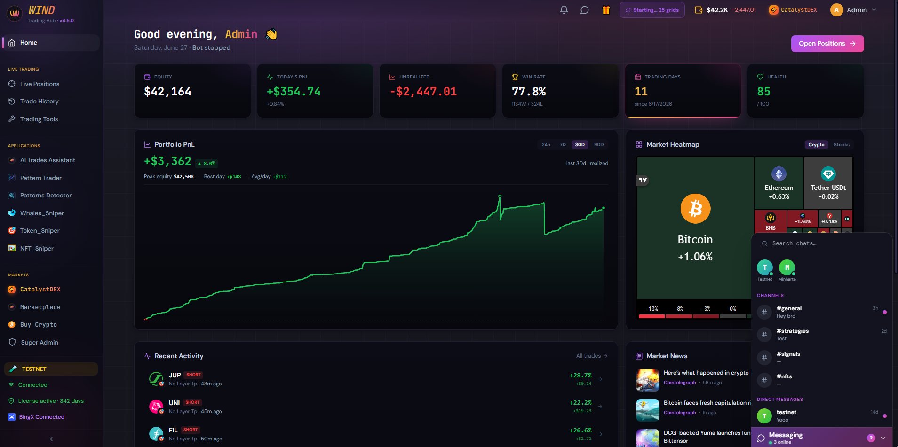

<div align="center">

# 🌬️ Wind

### The self‑hosted, non‑custodial crypto trading **hub**

Run it on **your** machine or VPS, against **your** exchange accounts and **your** wallets.
**Wind never holds your funds.**

[](#-install-in-one-command)

[](#-open-beta)

<br>



<sub><em>Example dashboard (testnet). Wind reads PnL straight from your exchange — results depend on your strategy and the market; Wind never promises profit.</em></sub>

</div>

---

## 🚀 Install in one command

You only need **[Docker Desktop](https://www.docker.com/products/docker-desktop/)** (Windows / macOS / Linux).

```bash
docker run -d --name wind -p 3010:3010 -v wind-data:/app/backend/data \
  ghcr.io/aiomacademy/wind-trades-hub:latest
```

Then open **http://localhost:3010** — done.

> **No exchange API key and no capital needed on first run.** Create a non‑custodial wallet, browse the
> marketplace, and backtest a strategy. Connecting an exchange to **trade live** is a separate, optional
> step you take only when *you* are ready.

### 🪟 Windows — no terminal
Prefer not to touch a command line? Download the **[install bundle](#-the-install-bundle)** (a
`docker-compose.yml` + the `scripts/windows/` folder), then **double‑click `wind-tray.vbs`**. You get a
tray icon with **Show Wind · Restart Wind · Quit Wind**.

### Update / stop later
```bash
docker pull ghcr.io/aiomacademy/wind-trades-hub:latest && docker restart wind   # update
docker stop wind                                                                # stop (data kept)
```

---

## 🧩 What's inside

| | |
|---|---|
| **⚙️ Trade Engine** | Multi‑strategy automation (bidirectional grid + deep DCA, John Wick trailing, Pattern Trader, auto‑reverse), multi‑exchange, risk monitor, liquidation guard, faithful backtester. |
| **⚡ Catalyst DEX & Wind Wallets** | On‑chain markets, multi‑chain swap, Buy Crypto, **non‑custodial** EVM + Solana wallets, Token / Whale / NFT snipers (scanner‑only — the bot never auto‑buys). |
| **🛒 Marketplace** | Buy / sell / rate strategies, NFTs, items and **app passes**; seller storefronts; leaderboard. |
| **🔑 Wind ACCESS** | Unlock premium apps (Chat, Pattern Trader, the snipers, the AI Assistant…) with collectible **passes** — yours to keep. |
| **🤖 AI Trades Assistant** | A context‑aware copilot that proposes trims/closes — it never executes anything without your one‑tap approval. |
| **💬 Wind Chat** | Channels + DMs between Wind users, hosted by the master. |

---

## 🔒 Non‑custodial by design

Your wallet keys are generated **locally** and stay **encrypted on your own machine** — Wind cannot move
your funds and never auto‑transfers anything. Marketplace payments are **peer‑to‑peer on‑chain** (you pay
the seller's wallet directly; the tx is verified on‑chain). **Your keys, your machine, your funds.**

> Wind is a **trading terminal, not a hype coin** — it **never promises profit**. Markets are risky;
> a faithful backtester shows losing strategies as losing. Trade only what you can afford to lose.

---

## 📦 The install bundle

Don't want to type Docker commands? Grab the bundle in this repo:

- **`docker-compose.yml`** — one‑command start: `docker compose up -d`.
- **`scripts/windows/`** — the no‑terminal Windows tray (Show / Restart / Quit) + how to auto‑start with Windows.

Download this repo as a ZIP (green **Code → Download ZIP**), unzip, and follow `scripts/windows/README.md`
on Windows, or just `docker compose up -d` anywhere.

---

## 🧪 Open BETA

Wind is in **open BETA** — free to self‑host and explore. The trading engine moves **real money** the moment
you connect an exchange, so start on testnet / small. Premium apps unlock via **Wind ACCESS** passes.

## ❓ Is the source code here?
No. Wind ships as this **pre‑built public image** so anyone can run it; the **source stays private**. That's
by design — what you get is the running hub, on your machine, fully under your control.

## 📜 License & disclaimer
Wind is provided **as‑is**, for use under its terms, with **no warranty** and **no financial advice**. You
are solely responsible for your trades, keys, and funds. Not affiliated with any exchange. See `LICENSE`.

<div align="center">

— built by **AiomAcademy** · self‑hosted · non‑custodial —

</div>
